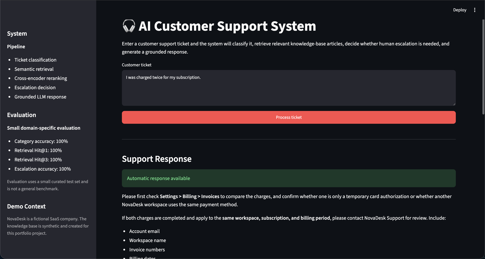
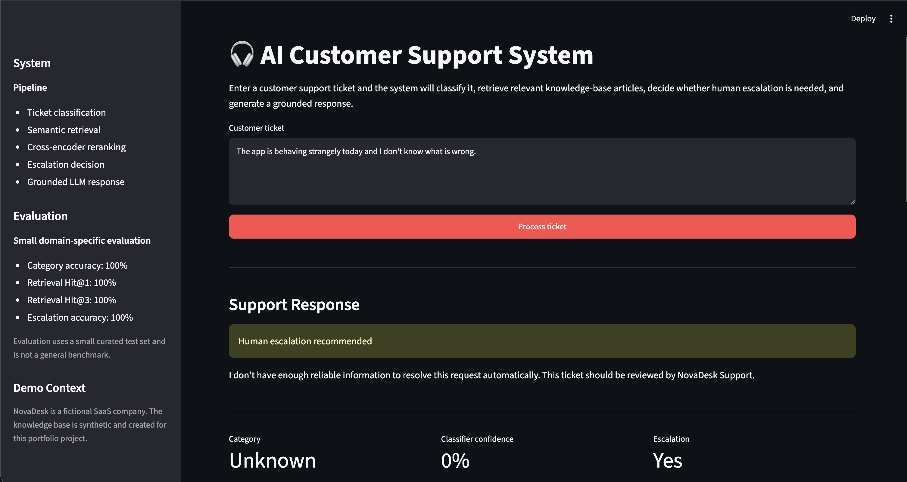

# AI Customer Support System

An end-to-end AI customer support application for a fictional SaaS company called **NovaDesk**.

The system receives a customer ticket, classifies the request, retrieves relevant knowledge-base articles, reranks them, decides whether human escalation is required, and generates a grounded support response.

## Live Demo

Streamlit deployment coming soon.

## Overview

This project demonstrates a complete AI support workflow rather than a single machine-learning model.

### Pipeline

Customer Ticket  
↓  
Ticket Classification  
↓  
Semantic Retrieval  
↓  
Cross-Encoder Reranking  
↓  
Escalation Decision  
↓  
Grounded LLM Response

The application is designed to avoid answering automatically when there is insufficient evidence in the knowledge base.

## Features

- Ticket category classification
- Semantic retrieval with sentence embeddings
- FAISS vector search
- CrossEncoder reranking
- Grounded LLM response generation
- Confidence-based human escalation
- Out-of-scope detection
- Transparent retrieval and reranker scores
- Streamlit interface
- Automated evaluation suite
- Pytest test suite

## Demo Company

**NovaDesk** is a fictional SaaS company created specifically for this portfolio project.

The synthetic support knowledge base covers:

- Billing and subscription payments
- Duplicate charges
- Refunds
- Subscription cancellation
- Password and login problems
- Two-factor authentication
- Account and workspace deletion
- Workspace data export

No real customer data is used.

## Architecture

### 1. Ticket Classification

The ticket is routed into one of the following categories:

- `billing`
- `account_access`
- `security`
- `account_management`
- `data`
- `unknown`

The classifier uses deterministic text patterns together with confidence logic.

### 2. Semantic Retrieval

Knowledge-base articles are embedded using `sentence-transformers/all-MiniLM-L6-v2`.

The embeddings are normalized and indexed using FAISS. The customer ticket is embedded using the same model and the most semantically similar articles are retrieved.

### 3. Cross-Encoder Reranking

Initial retrieval candidates are reranked using `cross-encoder/ms-marco-MiniLM-L-6-v2`.

The CrossEncoder evaluates the customer ticket and each candidate article together to produce a more precise relevance ranking.

### 4. Escalation Logic

Before generating an automatic answer, the system evaluates:

- Ticket category
- Classifier confidence
- Semantic retrieval score
- CrossEncoder reranker score

Current thresholds:

- Classifier confidence: `0.70`
- Semantic retrieval score: `0.25`
- Reranker score: `-3.0`

Human escalation can be triggered by an unknown category, low classifier confidence, weak semantic retrieval, or weak reranker evidence.

### 5. Grounded Response Generation

Supported tickets are passed to an OpenAI model together with retrieved knowledge-base context.

The generation prompt instructs the model to:

- Use only the supplied support information
- Avoid inventing policies or procedures
- Avoid claiming real account actions were completed
- Avoid promising refunds or account changes
- Recommend NovaDesk Support when evidence is insufficient

Tickets requiring escalation do not use the LLM to invent a resolution.

## Evaluation

The project includes a small curated domain-specific evaluation set.

| Metric | Result |
| --- | ---: |
| Category Accuracy | 100% |
| Retrieval Hit@1 | 100% |
| Retrieval Hit@3 | 100% |
| Escalation Accuracy | 100% |

Evaluation size:

- 10 routing and escalation cases
- 7 supported retrieval cases
- 3 out-of-scope cases

These results come from a small project-specific evaluation set and should **not** be interpreted as a general production benchmark.

Run the evaluation with:

`python scripts/evaluate_system.py`

## Automated Tests

The project includes automated tests covering classification, retrieval, and escalation behavior.

Current result: **5 passed**

Run:

`pytest -q`

## Application Screenshots

### Automatic Support Response

### Human Escalation

## Example

Customer ticket:

> I was charged twice for my subscription.

The system can:

1. Classify the ticket as billing
2. Retrieve the **Duplicate Charges** article
3. Rerank related support documentation
4. Determine whether automatic handling is appropriate
5. Generate a grounded support response

For an unsupported request:

> The app is behaving strangely today and I don't know what is wrong.

the system detects weak evidence and recommends human escalation instead of generating an unsupported solution.

## Project Structure

- `app/app.py` — Streamlit interface
- `src/classifier.py` — ticket classification
- `src/retrieval.py` — semantic retrieval and reranking
- `src/escalation.py` — escalation decision logic
- `src/generation.py` — grounded LLM response generation
- `src/pipeline.py` — end-to-end orchestration
- `data/knowledge_base/` — synthetic support documentation
- `scripts/evaluate_system.py` — evaluation suite
- `tests/test_pipeline.py` — automated tests
- `images/app/` — application screenshots

## Run Locally

Clone the repository:

`git clone https://github.com/Vercetius/ai-customer-support-system.git`

Enter the project:

`cd ai-customer-support-system`

Create the virtual environment:

`python3.12 -m venv .venv`

Activate it:

`source .venv/bin/activate`

Install dependencies:

`pip install -r requirements.txt`

Create a `.env` file containing:

`OPENAI_API_KEY=your_api_key_here`

`OPENAI_MODEL=gpt-5.6-luna`

Run the application:

`streamlit run app/app.py`

## Environment Variables

The application expects:

- `OPENAI_API_KEY`
- `OPENAI_MODEL`

Never commit the real `.env` file or an API key to GitHub.

## Limitations

This is a portfolio demonstration rather than a production customer-support platform.

Important limitations:

- The knowledge base contains only eight synthetic articles
- The ticket classifier uses deterministic routing rules
- The evaluation set is small and domain-specific
- Retrieval thresholds were tuned for this project
- The system does not integrate with real billing, CRM, identity, or ticketing systems
- The LLM cannot perform real account actions
- Unrelated requests can still produce retrieval candidates
- Escalation logic prevents weak retrieval evidence from being treated as a reliable automatic answer

A production implementation would require broader evaluation, authentication, access control, observability, audit logging, stronger out-of-domain detection, data governance, and integration with real business systems.

## Tech Stack

- Python
- Streamlit
- Sentence Transformers
- FAISS
- CrossEncoder reranking
- OpenAI API
- python-dotenv
- pytest

## License

MIT License.
